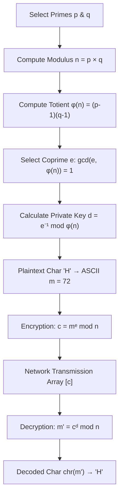

# 🔐 RSA Cryptography Guided Experience & Visualizer
## Presentation Guide, Project Documentation & Codebase Architecture

---

## 📋 Table of Contents
1. [Project Overview & Elevator Pitch](#1-project-overview--elevator-pitch)
2. [Slide-by-Slide Presentation Deck](#2-slide-by-slide-presentation-deck)
3. [File Structure & Repository Layout](#3-file-structure--repository-layout)
4. [Deep-Dive Code Architecture & Function Explanation](#4-deep-dive-code-architecture--function-explanation)
5. [Mathematical Foundation & Algorithm Flow](#5-mathematical-foundation--algorithm-flow)
6. [Live Demo Script & Walkthrough Instructions](#6-live-demo-script--walkthrough-instructions)

---

## 1. 🚀 Project Overview & Elevator Pitch

**RSA Cryptography Guided Experience** is an interactive, web-based virtual laboratory designed to demystify asymmetric public-key cryptography. Built with **Python**, **Streamlit**, and **WebAssembly (Stlite)**, it provides an intuitive 4-step guided pipeline that takes users from prime number selection and key derivation to character-by-character modular encryption, network payload transmission, and private key decryption.

### Key Highlights
- 🧠 **Educational Stepper**: Interactive step-by-step visual animation with playback speed control.
- 👤 **Dual Workstation Visualization**: Real-time side-by-side terminal simulation for **Sender (Encryption)** and **Receiver (Decryption)**.
- ⚡ **Zero-Server Client Execution**: Runs client-side in WebAssembly (Wasm) with 100% data privacy.
- 🎨 **Modern Dark SaaS Design System**: Sleek slate/zinc contrast palette with purple/emerald accents.

---

## 2. 📊 Slide-by-Slide Presentation Deck

### Slide 1: Title & Introduction
- **Title**: RSA Cryptography Guided Experience & Visualizer
- **Subtitle**: Interactive Asymmetric Cryptography Simulation & Virtual Laboratory
- **Key Talking Point**: "Today we are presenting an interactive web-based visualizer that turns abstract RSA mathematical formulas into an intuitive, step-by-step laboratory."

### Slide 2: The Problem & Motivation
- **The Challenge**: Public-key cryptography (RSA) relies on number theory concepts like Euler's Totient function and Extended Euclidean modular inverses that are difficult to visualize using static equations.
- **Our Solution**: A step-by-step pipeline displaying real-time dual-workstation encryption and decryption side-by-side.

### Slide 3: RSA Core Mathematics
- **Prime Key Derivation**:
  1. Pick distinct primes $p$ and $q$.
  2. Compute Modulus $n = p \times q$.
  3. Compute Euler's Totient $\phi(n) = (p-1)(q-1)$.
  4. Select Public Exponent $e$ such that $\gcd(e, \phi(n)) = 1$.
  5. Calculate Private Exponent $d = e^{-1} \pmod{\phi(n)}$ via Extended Euclidean Algorithm.
- **Encryption & Decryption**:
  - Encrypt: $c = m^e \pmod n$
  - Decrypt: $m = c^d \pmod n$

### Slide 4: System Architecture & Technology Stack
- **Frontend / UI**: Streamlit with custom CSS (Linear/Vercel Dark SaaS aesthetic).
- **WebAssembly Engine**: Stlite (`@stlite/mountable`) running Python client-side in WebAssembly.
- **Hosting**: Vercel Static CDN deployment (`@vercel/static`).

### Slide 5: The 4-Step Guided Experience
1. **🔑 Step 1: Key Setup**: Pick custom primes or load quick presets (Small, Standard, Medium, Fast, Large).
2. **💬 Step 2: Message & Encryption**: Enter plaintext; convert characters to ASCII and view ciphertext array.
3. **🧪 Step 3: Interactive Stepper**: Step through each character with auto-play controls and dual workstations.
4. **📊 Step 4: Summary Matrix**: Review complete transformation table and automated integrity verification.

### Slide 6: Production Security vs. Educational RSA
- **Educational Model**: Small primes ($p=61, q=53$) for transparent mathematical inspection.
- **Production RSA**: 2048 to 4096-bit primes, CSPRNG prime generation, and padding schemes (**RSA-OAEP** / **PSS**) to prevent attack vectors.

---

## 3. 📂 File Structure & Repository Layout

```
rsa-encryption-visualizer/
│
├── app.py                      # Core Python application (Streamlit UI & RSA math engine)
├── index.html                  # Root WebAssembly launcher (Stlite mounting interface)
├── requirements.txt            # Python dependencies specification
├── vercel.json                 # Vercel static deployment & CORS routing configuration
├── .vercelignore               # Files ignored by Vercel builder
├── LICENSE                     # MIT License
├── README.md                   # Repository documentation & getting started guide
│
├── .streamlit/
│   └── config.toml             # Streamlit dark theme configuration
│
├── public/                     # Static production bundle served on Vercel
│   ├── app.py                  # Synchronized mirror of core Python application
│   └── index.html              # Synchronized mirror of WebAssembly launcher
│
└── docs/
    └── PRESENTATION_DOCS.md    # Complete presentation guide & architecture documentation
```

---

## 4. 🔬 Deep-Dive Code Architecture & Function Explanation

### 1. Mathematical Helper Functions (`app.py`)

#### `is_prime(number)`
```python
def is_prime(number):
    if number < 2: return False
    if number == 2: return True
    if number % 2 == 0: return False
    for i in range(3, int(math.sqrt(number)) + 1, 2):
        if number % i == 0: return False
    return True
```
- **Purpose**: Validates whether an integer is prime using $O(\sqrt{n})$ trial division.
- **Role in App**: Prevents invalid non-prime numbers from being entered into $p$ or $q$.

#### `gcd(a, b)` & `extended_gcd(a, b)`
```python
def extended_gcd(a, b):
    if a == 0:
        return b, 0, 1
    gcd_val, x1, y1 = extended_gcd(b % a, a)
    x = y1 - (b // a) * x1
    y = x1
    return gcd_val, x, y
```
- **Purpose**: Computes Greatest Common Divisor $\gcd(a,b)$ and Bézout coefficients $(x, y)$ such that $a \cdot x + b \cdot y = \gcd(a, b)$.
- **Role in App**: Computes modular multiplicative inverse $d$.

#### `modular_inverse(e, phi)`
```python
def modular_inverse(e, phi):
    gcd_val, x, _ = extended_gcd(e, phi)
    if gcd_val != 1:
        return None
    return x % phi
```
- **Purpose**: Calculates $d = e^{-1} \pmod{\phi(n)}$. Returns `None` if $e$ and $\phi(n)$ are not coprime.

---

### 2. Streamlit Session State & Callback Architecture

To prevent widget state desynchronization (e.g. when setting number input values from preset buttons), explicit Streamlit `on_click` callback handlers are used:

```python
def apply_preset(p, q, e):
    st.session_state.p = p
    st.session_state.q = q
    st.session_state.e = e
    st.session_state.mp_p = p
    st.session_state.mp_q = q
    st.session_state.mp_e = e
    st.session_state.step_idx = 0
    st.session_state.is_playing = False
```

- **Mechanism**: Clicking preset buttons fires `apply_preset()` **before** Streamlit reruns the script, guaranteeing instant UI synchronization without state conflicts.

---

### 3. WebAssembly Integration (`index.html` & `public/index.html`)

```html
<script src="https://cdn.jsdelivr.net/npm/@stlite/mountable@0.73.0/build/stlite.js"></script>
<script>
  fetch('./app.py')
    .then(res => res.text())
    .then(code => {
      stlite.mount({
        entrypoint: "app.py",
        files: { "app.py": code },
        streamlitConfig: { "theme.base": "dark", "theme.backgroundColor": "#0b0f19" }
      }, document.getElementById("root"));
    });
</script>
```

- **Execution Flow**: Fetches `app.py` directly from static web host, initializes Pyodide Python WebAssembly runtime in the browser, and renders the application with zero backend server overhead.

---

## 5. 🧮 Mathematical Foundation & Algorithm Flow



---

## 6. 🎬 Live Demo Script & Walkthrough Instructions

### Step-by-Step Demo Script for Presentation:
1. **Open Application**: Navigate to live app site or run `python3 -m streamlit run app.py`.
2. **Demonstrate Key Setup (Tab 1)**:
   - Point out the active prime values $p=61, q=53$.
   - Click **`🎲 Small (11, 13)`** preset to show live derivation: $n=143, \phi(n)=120, e=7, d=103$.
3. **Demonstrate Encryption (Tab 2)**:
   - Type custom message `"HELLO RSA"`.
   - Show the generated ASCII array and ciphertext integer array.
4. **Demonstrate Interactive Stepper (Tab 3)**:
   - Click **`⏯ Auto Play`** to watch the visual stepper animate character-by-character.
   - Show how Sender computes $c = m^e \bmod n$ while Receiver decrypts $m = c^d \bmod n$.
5. **Demonstrate Summary Matrix (Tab 4)**:
   - Show full character transformation table and point to the **`🎉 Message Integrity Verified`** success badge.

---
*Documentation compiled for RSA Cryptography Guided Experience Presentation.*
